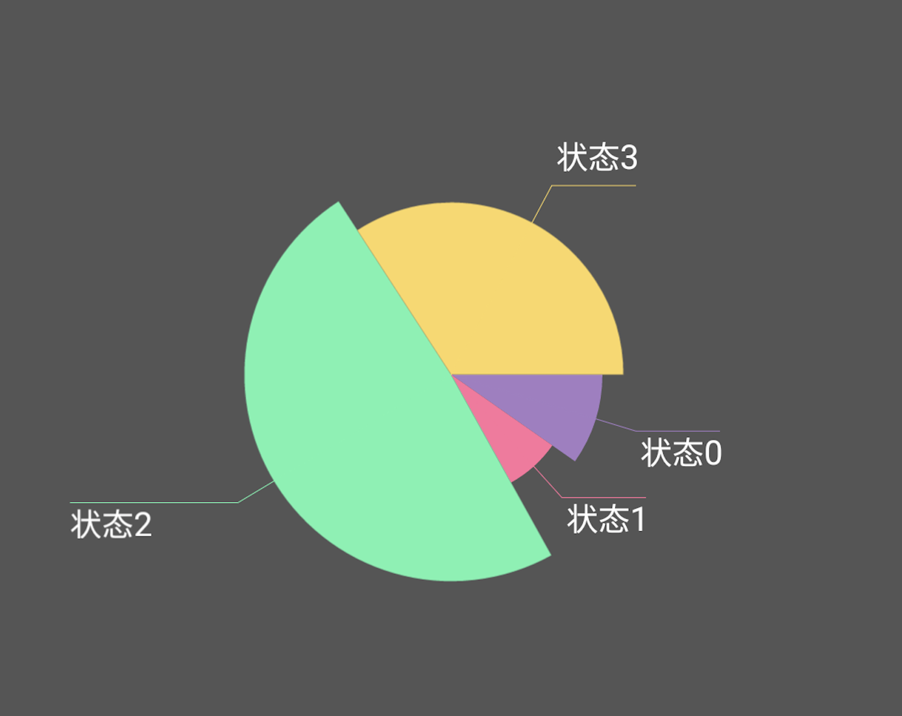

# 可视化数据图 - 自定义扇形饼状图

## 组件特性

1. 根据传入的四种数据量大小自动显示扇形的弧度大小以及弧度半径大小
2. 根据弧度所在的角度自动画出横线和斜线位置并显示状态

## 效果图



## 实现原理

1. 将圆弧和线拆分来看，先画圆弧，再画线
2. 弧度的画法，利用sdk的new Recf(start_x, start_y, end_x, end_y)来限定幅度半径，在用canvas.drawArc画出多少的弧度
3. 画线，线分为斜线和直线（斜线是半径方向，直线时水平方向）

__线的画法有两种：__

__方法一：__
根据已知弧度的角度和半径，在坐标轴上利用正余弦sin和cos计算出斜线的终点坐标，用drawLine画出即可，直线部分亦可

__方法二：__
画布canvas有一个重要的api，canvas.rotate(角度，x, y)，这个方法就是围绕着某一个点进行旋转；这刚好可以利用到我们的斜线画法上来，步骤如下：
1. 画斜线 -- 画一个圆弧后，以圆心为旋转点，旋转一定圆弧角度，屏幕x轴刚好在一般角度上，x轴就是我们斜线方向，此时斜线的终点就是圆弧半径在加一点距离即可
2. 画直线 -- 斜线画完后，我们在反向旋转，之前旋转多少度，我们就反向旋转多少度，__反向旋转的点选取上面斜线的终点__，此时直线的起点就是上面斜线的终点，直线终点我们又是x轴上面加一段距离即可
3. 上面完成后，我们要回复初始化状态canvas.restoreCount()恢复到最初的状态，然后继续画另一个圆弧的斜线和直线

很明显上述方法二不需要特别复杂的计算即可完成，我这里也采用了方法二


## 使用方法

### 布局layout

```
<com.jack.sectorview.SectorView
        android:layout_width="match_parent"
        android:layout_height="match_parent"
        android:gravity="center"
        app:lost_status="@color/colorLightBlue"
        app:open_status="@color/colorPink"
        app:normal_status="@color/colorGreen"
        app:lowpower_status="@color/colorYellow"
        android:id="@+id/sector"/>
```

上面用了我自定义的属性，分别用以标记几个扇形图的颜色，可以自定义，也可以使用我默认的颜色

### 代码java

```java
//模拟数据  index 0~3分别对应扇形图的 状态0~3
        ArrayList<Integer> testData = new ArrayList<>();
        testData.add(1511);
        testData.add(1156);
        testData.add(7541);
        testData.add(5330);

        mSectorView = (SectorView) findViewById(R.id.sector);
        mSectorView.setmAngelePerStatus(testData);
```

如上面注释，数据对应关系看效果图就可以了；

mSectorView.setmAngelePerStatus(testData);这句代码的作用就是讲每个数据量转化为角度，方法名可能取得不恰当

## 部分代码解释

### 成员

```java
    private int[]  mAngelePerStatus;   //每个状态对应的角度
    private int[]  mAngeleSort;        //对上面的角度进行排序，此数组存放了上面每个角度排在第几位
    /**
     * 圆心类，标注圆心的位置
     */
    private class CirclePoint{
        int x;
        int y;				//圆心的坐标
        int radius;
        int[] radiusLevel = new int[4];                 //因为有四个圆弧，所以设置了四个等级的圆弧半径
    }

```

### 画圆弧

```java
/**
     * 画基础的扇形，必须先画扇形后面再画横线斜线等
     * @param canvas
     */
    private void drawSector(Canvas canvas){

        RectF rectF;
        int startAngle = 0;
        for(int i = 0; i < mAngelePerStatus.length; i++){
            if(mAngelePerStatus[i] <= 0){                      //小于等于0说明这部分没有的
                continue;
            }
            int sweep = mAngelePerStatus[i];
            if(i == mAngelePerStatus.length - 1) {
                sweep = 360 - startAngle;
            }
            int currentAngleLevel = mAngeleSort[i];
            int currentAngleRadius = mCircle.radiusLevel[currentAngleLevel];
            int startX = mCircle.x - currentAngleRadius;
            int startY = mCircle.y - currentAngleRadius;
            int endX   = mCircle.x + currentAngleRadius;
            int endY   = mCircle.y + currentAngleRadius;
            rectF = new RectF(startX, startY, endX, endY);
            mPaint.setColor(mColorPerStatus[i]);
            canvas.drawArc(rectF, startAngle, sweep, true, mPaint);

            startAngle += mAngelePerStatus[i];
        }


    }

```

圆弧这个好理解，拿到圆弧角度，拿到其圆弧半径，在canvas上画出即可；在计算角度的时候可能出现了1度左右的误差，所以为了防止最后一个角度没有画到360度的线上，我做了一定的角度补偿

### 画斜线和直线

```java

    /**
     * 画线和字符
     * @param canvas
     */
    private void drawLineAndText(Canvas canvas){

        int baseAngle = 0;
        int src;

        for(int i = 0; i < mAngelePerStatus.length; i++){
            src = canvas.save();

            if(mAngelePerStatus[i] <= 0){
                continue;
            }

            int currentAngleLevel = mAngeleSort[i];
            int rotateAngle =  baseAngle + mAngelePerStatus[i] / 2;             //需要旋转的角度
            //刚好在坐标轴上的情况，画斜线会变成垂直水平的线  不好看  稍微偏移一下
            if(rotateAngle%90 == 0){
                rotateAngle = rotateAngle + 3;
            }
            int slashLineEndX = mCircle.x + mCircle.radiusLevel[currentAngleLevel] + mSlashLineLength;


            canvas.rotate(rotateAngle, mCircle.x, mCircle.y);
            mPaint.setColor(mColorPerStatus[i]);
            canvas.drawLine(mCircle.x, mCircle.y, slashLineEndX, mCircle.y, mPaint);        //画斜线
            canvas.rotate(-rotateAngle, slashLineEndX, mCircle.y);


            int horizonLineEndX;
            int textStartY;
            int textStartX;
            //画水平直线时要考虑在左边还是右边，两边起点和终点是有区别的
            if(rotateAngle > 90 && rotateAngle < 270){

                horizonLineEndX = mCircle.x + mCircle.radiusLevel[currentAngleLevel] - mHorizonLineLength;
                if(horizonLineEndX < 0){                                                 //防止其超出左边边界
                    horizonLineEndX = 0;
                }
                textStartX = horizonLineEndX;

            }else{

                horizonLineEndX = mCircle.x + mCircle.radiusLevel[currentAngleLevel] + mHorizonLineLength;
                if(horizonLineEndX > mViewWidth){                                       //防止超出右边界
                    horizonLineEndX = mViewWidth;
                }
                textStartX = slashLineEndX + 5;
            }
            Log.i(TAG, "horizontal start " + slashLineEndX + " " + horizonLineEndX);
            canvas.drawLine(slashLineEndX, mCircle.y, horizonLineEndX, mCircle.y, mPaint);  //画直线

            //画字时考虑上半圆和瞎下半圆时，上半圆字在上面，下半圆字在下面
            if(rotateAngle < 180){
                textStartY = mCircle.y + 40;

            }else{
                textStartY = mCircle.y - 20;
            }

            canvas.drawText(mStatusInfo[i], textStartX, textStartY, mTextPaint);
            canvas.restoreToCount(src);
            baseAngle += mAngelePerStatus[i];
            Log.i(TAG, "baseAngle " + baseAngle + " rotateAngle " + rotateAngle);

        }

    }
```
思路就是我最上面的原理一样，旋转和反向旋转，旋转的时候如果刚好旋转到90、180、370这样的角度上，斜线会出现垂直和水平的斜线，这样不美观，所以当出现这些情况又做了一些角度补偿

### 相邻角度太小的情况

测试的时候发现一个问题，相邻两个角度太小如3和6度，这种情况导致斜线或直线或汉子会出现重合的现象，这又是不好的，所以这个方法是就是用来处理这个问题的；采取的策略就是：
1. 当检测出角度小于5度并相邻角度差也小于5，会强制后面一个角度变大一点，这样增大了角度间距，写字时就不会重合
2. 最后一个角度和第一个角度出现了上述情况后，就不能茫然的把第一个角度变大，变大可能会导致第一个和第二个又重合了，所以就只能把第一个加的值加小一点，这样就可以解决了
3. 上述的做法会带来一个问题，就是四个角度和会超过360；这需要把多出来的角度算出来，从四个角度中最大角度减去多出来的就可以了

```java

    /**
     * 角度小于5度的情况，并且相邻角度相差不大的要相邻状态其中一个要加一个角度,
     * 否则写字时文字会重合在一起
     * @param array
     */
    private int angleBuChang(int[] array){

        int length = array.length - 1;

        if(length <= 2){
            return 360;
        }
        int angle0, angle1;
        for(int i = 0; i< length + 1; i++){
            angle0 = array[i];
            if(i + 1 > length){
                angle1 = array[0];
            }else{
                angle1 = array[i+1];
            }

            int angleRemain = Math.abs(angle1 - angle0);
            if(angle0 < 5 && angleRemain < 5){      //这两个加数就是调整角度差的
                if(i+1 > length){
                    array[0] += angleRemain + 10;
                }else {
                    array[i+1] += angleRemain + 15;
                }
            }
        }

        int totalAngle = 0;
        for(int i = 0; i <  length + 1; i++){
            totalAngle += array[i];
        }

        return  totalAngle;
    }
```

综上，基本上解决了所有的问题了，如还有不正确的，可以给我指正并修改；
